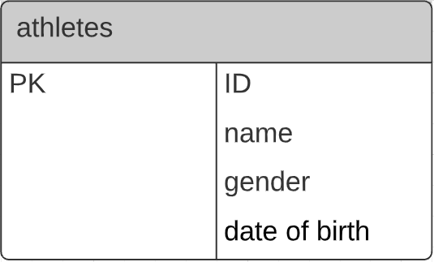

# CSI 2532 - Livrable 1


<h2>Diagramme Entité-Relation</h2>


<h2>Diagramme relationnel</h2>

(le même pour l'instant)


<h2>Schema SQL</h2>

```
CREATE TABLE athletes(
	ID int,
	name varchar(255),
	dateOfBirth date,
	gender varchar(255)
);
```

<h2>Exemple de SQL</h2>


<h3>INSERT</h3>

```
INSERT INTO athletes(ID, name, dateOfBirth, gender)
VALUES 
	(1, 'Jojo Lethug', '2000-10-02', 'male'),
	(2, 'Dio Levillain', '2000-01-02', 'male'),
	(3, 'Micheline Michelin', '1976-12-12', 'female'),
	(4, 'Jean-Michel Crapaud', '1992-04-02', 'crapaud'),
	(5, 'Jackie Chan', '1980-10-03', 'man');
```

<h3>DELETE</h3>

```
DELETE from athletes 
where ID = 3;
```

<h3>UPDATE</h3>

```
UPDATE athletes
  SET gender = 'male'
  WHERE name = 'Jean-Michel Crapaud';
```

<h3>SELECT</h3>

```
SELECT name, gender
FROM athletes
WHERE gender <> 'male'
ORDER BY gender DESC, name ASC;
```