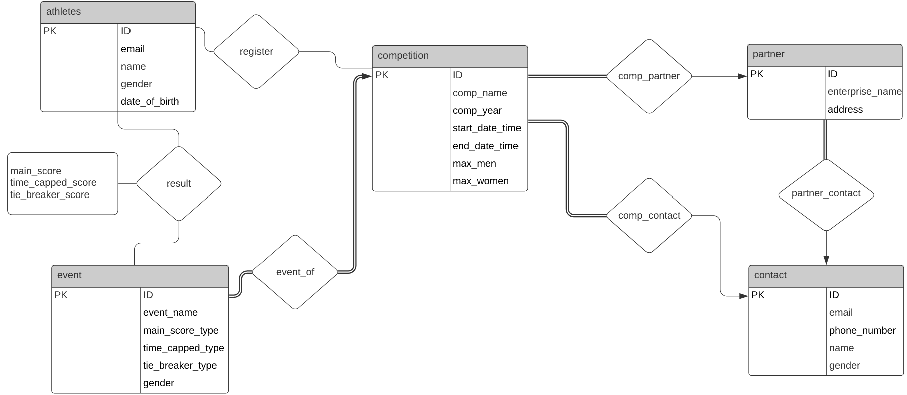
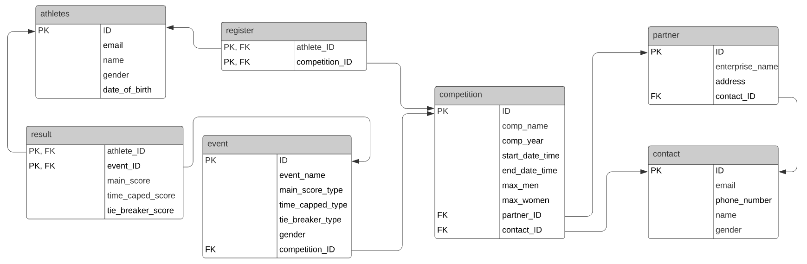

# CSI 2532 - Livrable 3

Une base de donnée pour les compétition et des classements d'athlètes.
<h2>Diagramme Entité-Relation</h2>



<h2>Diagramme relationnel</h2>




<h2>Schema SQL</h2>

Nous utilisons l'outil de requête de PGadmin 4 v4 pour créer la base de données à partir du schema SQL retrouvé dans le fichier schema.sql.

Il est aussi possible d'obtenir ce schema en effectuant les migrations du dossier "migrations" en ordre croissant de leur ID. Le processus avec PGadmin est le suivant:

1. Ouvrir Query Tool.\
2. Écrire la commande de la migration dans l'onglet "Query Editor".\
3. Exécuter la commande\
4. Recommencer pour les autres migrations.

<h2>Seed SQL</h2>

Le fichier seed.sql contient une série de valeurs à insérer dans la base de donnée.\
Elle peut être exécutée de la même manière que les migrations.

<h2>Application php en lecture seule</h2>

Assurez-vous de demarer les fichier .sql dans postgreSQL database. copiez les fichier .php (retrouver dans phpapp folder) dans votre webserver fichier document root (document root folder). modifiez la connection string postgreSQL dans le fichier 'sql.PHP' pour pointer a votre base de donnees. le menu est accedable a 'http.localhot/index.php'.

*English Translated:*
*Make sure to run the .sql files onto you postreSQL database. Copy the .php files *onto your webserver document root folder. Modify the postreSQL connection string *in the file 'sql.PHP' to point to your database. access http.localhost/index.php as the menu of the website*

<h2> Windows Users</h2>

Si vous utilisez AMPPS avec postgreSQL ver 13, notez une incompatibiliter de encryption de pw en methode d'authentification utiliser en PHP. Nous avions enlever l'authentificateur comme solution. pour plus d'info, regardez: https://forums.devart.com/viewtopic.php?t=35873

*English Translated:*
*If you're using AMPPS alongside PostgreSQL 13, there's an incompatibility between *the password encryption method and the authentication method used by PHP. We *had to disable authentication as a workaround. For more information read this *thread: https://forums.devart.com/viewtopic.php?t=35873*

<h2>Exemple de requêtes SQL</h2>

<h3>INSERT</h3>

```
INSERT INTO athletes(ID, email, name, gender, date_of_birth)
VALUES 
	(1, 'jlet207@gmail.com', 'Jojo Lethug',  'male', '2000-10-02'),
	(2, 'Dio.Levi@hotmail.com', 'Dio Levillain', 'male', '2000-01-02'),
	(3, 'Michmich@politico.ca', 'Micheline Michelin', 'female', '1976-12-12'),
	(4, 'LeCrapaud@canada.ca', 'Jean-Michel Crapaud', 'crapaud', '1992-04-02'),
	(5, 'Jackie123@gmail.com' 'Jackie Chan', 'man', '1980-10-03');
```

<h3>DELETE</h3>

```
DELETE from athletes 
where ID = 3;
```

<h3>UPDATE</h3>

```
UPDATE athletes
  SET gender = 'male'
  WHERE name = 'Jean-Michel Crapaud';
```

<h3>SELECT</h3>

```
SELECT name, gender
FROM athletes
WHERE gender <> 'male'
ORDER BY gender DESC, name ASC;
```
