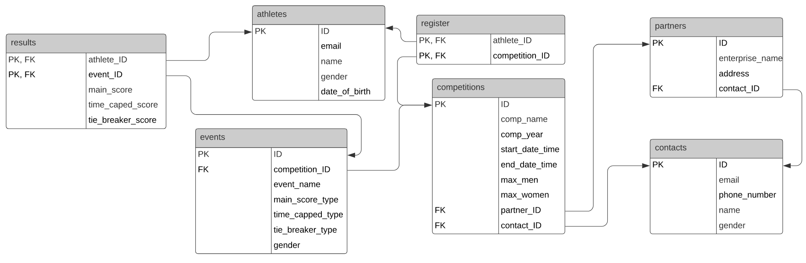

# CSI 2532 - Livrable 3

Une base de donnée pour les compétition et des classements d'athlètes.
<h2>Diagramme Entité-Relation</h2>


<h2>Diagramme relationnel</h2>




<h2>Schema SQL</h2>

Nous utilisons l'outil de requête de PGadmin 4 v4 pour créer la base de données à partir du schema SQL retrouvé dans le fichier schema.sql.

Il est aussi possible d'obtenir ce schema en effectuant les migrations du dossier "migrations" en ordre croissant de leur ID. Le processus avec PGadmin est le suivant:

1. Ouvrir Query Tool.\
2. Écrire la commande de la migration dans l'onglet "Query Editor".\
3. Exécuter la commande\
4. Recommencer pour les autres migrations.
 


<h2>Seed SQL</h2>

Le fichier seed.sql contient une série de valeurs à insérer dans la base de donnée.\
Elle peut être exécutée de la même manière que les migrations.

<h2>Application php en lecture seule</h2>

Un server peut être créé en exécutant cette commande dans le dossier "phpapp":
```
php -S localhost:4000
```
On peut s'y connecter à l'adresse http://localhost/index.php .
La commande SQL dans le fichier site.php peut être modifiée. (ligne 8)
Le mot de passe doit être celui de la base de données. 

<h2>Exemple de requêtes SQL</h2>

<h3>INSERT</h3>

Multiple exemples peuvent être trouvés dans le fichier 'seed.sql'.

<h3>DELETE</h3>

```
DELETE FROM partners WHERE ID = 31231;
```

<h3>UPDATE</h3>

```
UPDATE athletes
  SET name = 'Levillain Dio'
  WHERE id = 223;
```

<h3>SELECT</h3>

```
SELECT name, gender
FROM athletes
WHERE gender <> 'm'
ORDER BY gender DESC, name ASC;
```